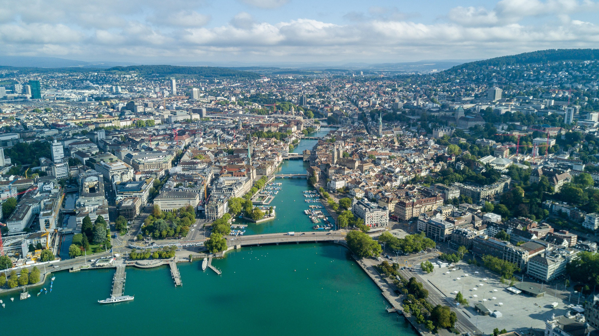

Digital, information and communication technologies, together with Big Data, the Internet of Things, and Artificial Intelligence, are reshaping almost every aspect of our societies. From traffic to logistics, from mobility to smart cities and societies, much of this gears towards more predictability, controllability, and automation, using digital twins and many other approaches. Optimizing performance, sustainability, resilience, and health are often stated goals. But what roles will complexity and collective intelligence, democracy and human rights, agency and freedom, co-creation and co-evolution play? And what do scientific approaches, from data to complexity to computational social science, from network to transportation to game theory, and from agent-based to ML- to AI-based modeling, have to say on this? 

This workshop aims at reflecting on the progress made in the past 20 years and tries to develop a vision for the future. It will provide ample opportunities for a critical reflection of the scientific investigation methods and technological engineering approaches we pursue. We aim for constructive criticism, and for stimulating debate and exchange, i.e. for an overall inspiring and enriching experience.

